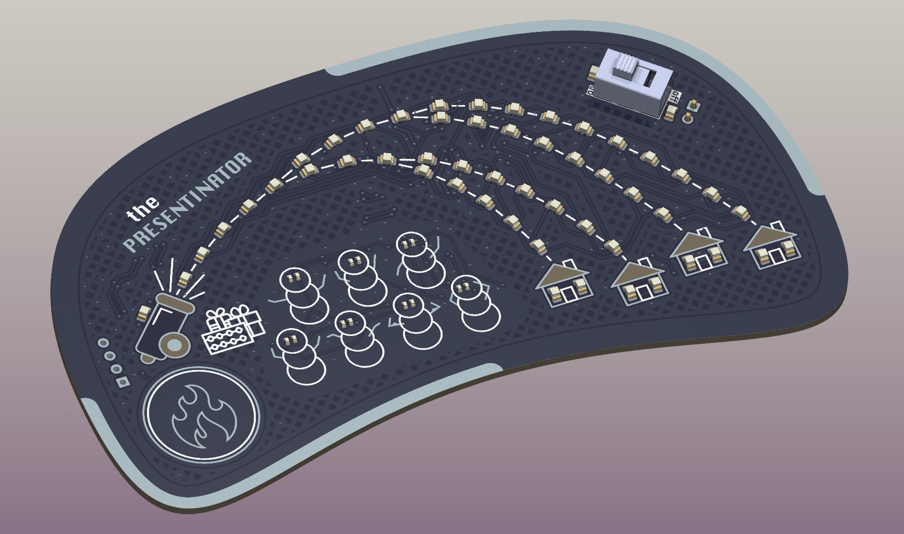

# the PRESENTINATOR

## Plot
Santa got a cold, and it's December 24th! As his top elf you gotta step it up\
You decide to make a cannon to launch presents from the North Pole all over the world.\
Each house will light up when it's clock strikes midnight and you must shoot your target to the correct one.\
The longer you hold the trigger, the further your present will be shot. You call it, "the PRESENTINATOR".\
(Depending on how well this goes, you might be in for a raise aftewards... and boy do you love Candy Canes)

## Project

There's hardware, graphics, and soon to be firmware in this repo.\
I initially designed this as a four layer board, but when I experimenting with deleting the inner layers, practically all the grounds were routed together besides a few floating islands. Everything should be low speed enough so that's fine.\
The project is powered off of two 2032s, with a switch, and then minimal polarity protection and then bucked down to 3.3V.\
The brains of the operation is the STM32F030F4, a very minimal STM microcontroller.\
Over I2C it drives the IS31FL3731-SA LED Matrix driver, which is not used to full capacity.\
There's also a capactive sense button IC, as well as the capability to drive a vibration motor for full haptic I/O.

## Status
Hardware: Designed\
Board: Being manufactured\
Firmware: Will be done by Christmas

## License
MIT Open Source License-inator

## Motivation
I have some younger people in my life and a habit of making DIY christmas presents. In the past they've been largely "crafty" (e.g. wood, leather) but this year I went all-in on electronics.

## Inspiration
Roughly inspired by the [light rail](https://github.com/nonik0/Light-Rail) PCB train track project, as well as Doofenshmirtz's naming conventions.

